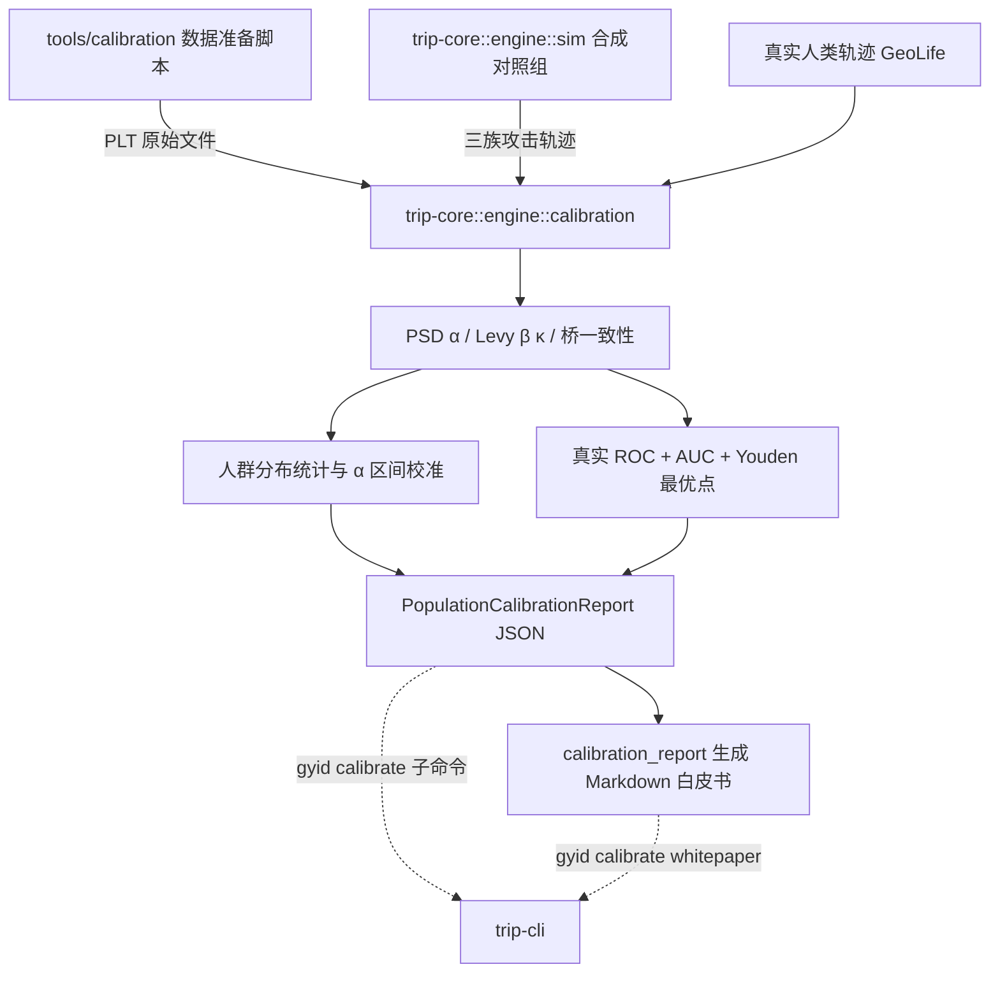

## 用户需求

继续 TRIP 项目的 W7 阶段并收尾，同时完成三项配套工作。

## 产品概述

W7 的目标是用真实人群轨迹数据校准经典临界性引擎的判定边界，并产出可对外提交的判别能力报告。当前代码骨架已在，但存在会产出错误结论的缺陷，且用户无法自行运行，因此本阶段聚焦于"让结论可信、让流程可跑通、让结果可复现"。

## 核心功能

- **标定结果可信**：报告中的分析时间必须反映真实日历时间；单条轨迹数据异常不得让整批分析中断。
- **判别能力可度量**：给出"真实人类轨迹"与"合成机器轨迹"之间的判别曲线及曲线下面积，而非只描述单一群体的分布；给出使判别最优的阈值。
- **人群边界校准**：统计真实人群指标分布的分位区间，与协议默认区间对比，给出覆盖率与替代区间建议。
- **命令行可直接使用**：提供命令入口，既支持用内置合成数据在全离线环境下快速跑通全流程，也支持接入真实公开数据集。
- **数据获取可复现**：提供数据集获取与准备的操作说明与脚本，大体积原始数据不进入版本库。
- **产出对外文档**：生成一份独立的标定报告文档，说明数据来源、处理方法、分布统计、判别结果与结论建议。
- **前端全流程浏览器验证**：在浏览器中实际走通身份创建、轨迹采集、数据导入、身份验证主流程，并留存页面与流程证据。
- **能力扩展与项目归档**：检索并安装与本任务相关的可复用能力；校正与实际严重不符的项目状态文档，并把长期未整理的变更按规范记录。

## 视觉与交互

标定报告文档为结构化图表 + 表格的阅读型文档；前端的视觉与交互不做改动，仅做端到端验证取证。

## 技术栈

沿用现有栈，不引入新技术：

- 标定与统计核心：Rust（`trip-core::engine`，`rustc 2021 edition`）
- 命令行：Rust + `clap` 4.5（`trip-cli`，二进制名 `gyid`），已有子命令模块范式 `anchor_cmds.rs`
- 序列化：`serde` / `serde_json`（`trip-core` 已为常规依赖）
- 仿真与随机数：`rand` 0.8（`StdRng` ChaCha12，可复现）、`trip-core::engine::sim`、`engine::levy`
- 空间量化：`h3o` 0.7，标定统一 `Resolution::Ten`（与协议默认一致）
- 数据获取与准备：Shell / Python 脚本（`curl`、`unzip`、`sha256sum`），不引入 Rust 侧网络依赖
- 前端验证：`vite` + `pnpm`（SolidJS 站点）、`trip-server`（axum，默认 `127.0.0.1:8080`）、`playwright-cli`

## 实现方案

### 总体策略

分三条互不阻塞的轨道推进：

1. **标定轨道（修正确性 → 补科学方法 → 接入口与工具 → 固化测试与文档）**
2. **前端验证轨道（起服务 → 浏览器跑通主流程 → 取证）**
3. **归档轨道（能力检索 → 状态文档重写 → 规范提交）**

标定轨道是主线，且严格遵循"先合成、后真实"：合成对照组离线、确定性、可进 CI，是真实数据结论的标尺。

### 关键技术决策

**1. 真实 ROC，而不是单群体伪 ROC**
现有 `compute_roc_analysis` 只用单个人类群体的 α 分布，把"低于阈值且高于 0.10 的比例"当作假阳率，且 `auc` 硬编码为 `None`——这在统计上不成立，却被写进报告第 5 节。改为引入**显式对照组**：

- 人类组：GeoLife 真实轨迹（或合成 `trip_walk_path` 作为离线替身）
- 对照组的三个攻击族（复用 `monte_carlo_smoke.rs` 已验证的生成器构造）：
- `IidLevy`：i.i.d. 截断 Levy 步进（草案 §7.3.3 字面生成器）→ α≈0
- `ReplayDrift`：共享录制序列 + 线性漂移 → α≳1.2（趋势谱）
- `CorrelatedGaussian`：AR(1) 速度积分 → α≳1.0（强低频相关）
- 阈值扫描按分数降序、同分样本合并成一组（消除并列顺序依赖），AUC 用 FPR 轴梯形积分，最优点取 Youden's J。分数越高越"像人"。

**2. 无对照组时 RocAnalysis 置空，而不是伪造**
没有对照数据时 `roc` 字段为 `None`，报告显式写明"需要对照组数据"，避免误导上游。

**3. 修复确定性缺陷，而不是绕过**

- `utc_now_iso()` 现用 `1970 + secs/31536000%100` 当时/月/日，产出的是错误日期并会写入报告与元数据。补 Howard Hinnant `civil_from_days`（与文件内已有 `days_from_civil` 互逆）并做往返测试。
- 三处 `partial_cmp(...).unwrap()`（α、β 排序与 Youden 取极值）遇 NaN 直接 panic。统一改为"先过滤非有限值再比较"的辅助函数，并在非空校验失败时返回 `TripError::Calibration`（接入已新增但尚未使用的错误变体）。

**4. 保持向后兼容，最小改动面**
`calibrate_trajectory`、`ProcessedTrajectory`、`PsdResult`、`LevyCalibResult` 等既有公开类型与行为不变；仅对 `generate_population_report` 与 `run_geolife_calibration` 增加"可选对照组"入参（这两个函数当前仅被库内部与新增 CLI 调用，无外部破坏面）。

**5. 性能与资源**
ROC 阈值扫描为 O((P+N) log(P+N))（排序主导）；对照组生成每条轨迹的 PSD 为朴素 O(N²) DFT，N=256 时约 6.5 万次浮点乘加，默认每组 200 条即秒级。GeoLife 单次全量标定受 PLT 解析与 DFT 主导，属离线批处理，可接受；不做缓存或并行化（YAGNI）。

**6. 数据集不入库**
`tools/calibration/` 增加的脚本把原始数据下载到 `tools/calibration/data/`（或可配置目录），该路径写入 `.gitignore`，仓库只保留脚本、说明与小型样例。

### 替代方案与取舍

- 备选：把统计与 ROC 放到 Python（numpy/scipy）。**否决**——标定必须使用与线上判定逐字节相同的引擎实现，否则结论不可迁移到 Verifier；ROC 与分位数是纯确定性计算，放进协议库还能被黄金向量测试覆盖。
- 备选：下载真实 GeoLife 后直接出结论。**否决**——1.9GB 数据在 CI 与离线环境不可用，必须先以合成对照固化可回归的测试基线。

## 架构设计



三层职责：

- **纯计算层**（`trip-core::engine::calibration`）：解析、量化、指标、统计、ROC。无 I/O、无网络、确定性。
- **报告层**（`trip-core::engine::calibration_report`）：JSON → Markdown，纯函数式改写。
- **驱动层**（`trip-cli::calibrate_cmds`）：文件 I/O、参数解析、进度输出，与 `anchor_cmds.rs` 的组织方式保持一致。

## 目录结构

```
GYIDpro/
├── trip-core/
│   └── src/engine/
│       ├── calibration.rs          # [MODIFY] 修复 utc_now_iso（新增 civil_from_days）与三处 NaN panic；新增对照组生成 ControlFamily + synthetic_control_alphas、真实 ROC 计算 roc_analysis（阈值降序扫描、同分合并、梯形 AUC、Youden J）；generate_population_report 增加 Option<&[f64]> 对照组入参，无对照时 roc=None；run_geolife_calibration 增加 control 参数并透传
│       ├── calibration_report.rs   # [MODIFY] 白皮书标题与数据集名参数化（不再写死 GeoLife）；第 5 节在无 AUC 时明确写出"需要对照组"；补充 α 区间覆盖率的结论分支
│       └── mod.rs                  # [MODIFY] 保持已声明的 calibration / calibration_report 模块，补充模块级说明
├── trip-core/
│   ├── src/error.rs                # [MODIFY] 已新增 Calibration(String)，本阶段由 roc_analysis 与统计校验实际使用
│   └── tests/
│       ├── calibration_golden.rs   # [NEW] 端到端标定黄金测试：合成人类组 + 三族对照组 → 断言 AUC、覆盖率、分位数、JSON 往返；固定 seed 保证可复现
│       └── vectors/
│           └── calibration-vectors.json  # [NEW] 固化合成标定的黄金向量（AUC、α 分位、每族 alpha 分布统计），供跨实现比对与回归
├── trip-cli/
│   └── src/
│       ├── calibrate_cmds.rs       # [NEW] gyid calibrate 子命令模块：CalibrateCmd 枚举 + dispatch；geolife（接真实数据目录，可加 --control N 生成对照组求 AUC）、synth（全合成离线跑通，输出指标与 ROC）、whitepaper（JSON → Markdown）。沿用 anchor_cmds.rs 的 clap 子命令 + dispatch 范式
│       └── main.rs                 # [MODIFY] 注册 Calibrate { action } 子命令并接入 dispatch
├── tools/calibration/
│   ├── README.md                   # [NEW] 数据集来源与许可、下载/解压/校验步骤、目录约定、gyid calibrate 用法示例、合规与不入库说明
│   ├── download_geolife.sh         # [NEW] 下载 GeoLife 压缩包、校验、解压到 data/ 并打印体量与路径；失败时给出可读错误
│   ├── prepare_dataset.sh          # [NEW] 校验目录结构（<user>/Trajectory/*.plt），输出统计摘要供标定前自检
│   └── .gitignore                  # [NEW] 忽略 data/ 与 *.zip，确保 ~1.9GB 原始数据不入库
├── docs/
│   └── CALIBRATION-W7-WHITEPAPER.md  # [NEW] W7 标定白皮书：数据集描述、方法学、α/β 分布统计、真实 ROC 与 AUC、边界校准建议、局限与后续工作（与既有 docs/WHITEPAPER.md 分开）
├── DEVELOPMENT_STATUS.md           # [MODIFY] 用当前 trip-* 架构与 W1–W8 真实进度替换过时的 geoyuan-core/M1–M8 内容
└── .gitignore                      # [MODIFY] 补充标定数据目录与浏览器取证产物（.playwright-cli/）
```

## 关键代码结构

以下签名是本阶段的核心契约，多个模块依赖：

```rust
// trip-core/src/engine/calibration.rs

/// 合成攻击轨迹族（ROC 对照组）。
pub enum ControlFamily { IidLevy, ReplayDrift, CorrelatedGaussian }

/// 生成某一族对照轨迹的 α 值（确定性，seed 可复现）。
pub fn synthetic_control_alphas(
    family: ControlFamily,
    count: usize,
    window: usize,
    seed: u64,
) -> Vec<f64>;

/// 用人类分数组与对照分数组计算真实 ROC（阈值降序扫描 + 梯形 AUC + Youden J）。
/// 任一组为空或过滤非有限值后为空时返回 Err(TripError::Calibration)。
pub fn roc_analysis(human_scores: &[f64], control_scores: &[f64]) -> Result<RocAnalysis>;

/// 生成人群报告；control_alphas 为 None 时 roc 字段为 None（不伪造）。
pub fn generate_population_report(
    dataset_name: &str,
    results: &[TrajectoryCalibration],
    control_alphas: Option<&[f64]>,
) -> PopulationCalibrationReport;
```

## 实现要点

- **确定性**：所有随机流程固定 seed；浮点一律 f64；分位数与 AUC 的算法在文档注释中写明，便于跨语言复现与黄金向量固化。
- **错误处理**：非测试代码禁用 `unwrap()`；NaN/空输入走 `TripError::Calibration`；PLT 解析失败逐文件跳过并计数，不中断整批（沿用 `run_geolife_calibration` 既有 `errors` 计数）。
- **日志与输出**：沿用既有 `println!` 进度输出风格（每 100 条打点），不引入新日志框架；不打印原始坐标（协议要求原始位置不出端，标定脚本同理只落量化结果）。
- **回归风险控制**：不改动 `psd` / `levy` / `sim` 的既有算法与常量，只新增调用方；`generate_population_report` 签名变更仅影响库内调用与新增 CLI。
- **质量门**：完成后必须 `cargo fmt --all`、`cargo clippy --workspace -- -D warnings` 零警告、`cargo test --workspace` 全绿；前端 `pnpm typecheck` + `pnpm build` 通过。
- **提交规范**：`<type>(<scope>): <message>`；标定数据与浏览器取证产物不得入库。

## Agent Extensions

### Skill

- **find-skills**
- Purpose: 在 SkillHub 搜索与本任务相关的可复用能力（数据科学、统计可视化、ROC 曲线绘图、Markdown 图表生成），并把匹配的技能安装到客户端技能目录
- Expected outcome: 输出候选技能清单（名称、描述、热度、安装命令），确认并安装后能在目标目录验证到 `SKILL.md` 存在；若有更合适的绘图/分析技能，白皮书图表可借助它产出

- **playwright-cli**
- Purpose: 启动本地 Verifier 服务与前端开发服务器，在真实浏览器中走通身份创建、轨迹采集、数据导入、身份验证主流程
- Expected outcome: 逐页快照与关键步骤截图（保存到取证目录），页面无控制台错误，主流程各步骤均能推进到预期状态；产出一份可复核的验证记录

### SubAgent

- **code-explorer**
- Purpose: 盘点仓库中长期未提交的 W1–W8 变更全貌（旧 crate 删除、新 crate 与前端新增、文件归属与分组）
- Expected outcome: 一份按模块归类的变更清单与建议的提交分组，使规范提交与 `DEVELOPMENT_STATUS.md` 重写都有据可依，避免遗漏或误提交